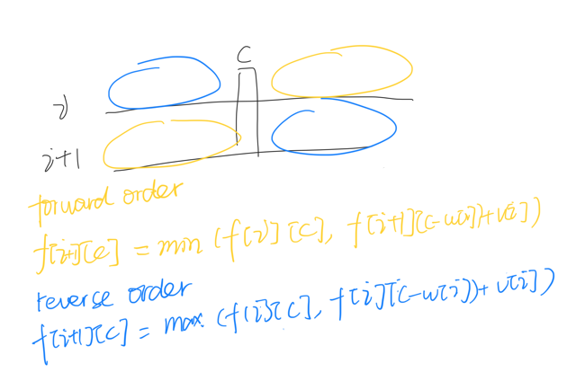

# 0-1 knapsack
```javascript
    var function(capacity, w, v){
        const n = w.length;
        function dfs(i, c){
            if(i<0)return 9;
            if(c<w[i])return dfs(i-1,c);
            return Math.max(dfs(i-1,c),dfs(i-1, c-w[i])+v[i])
        }
        return dfs(n-1, capacity)
    } 
```

# unbounded_knapsack
```javascript
    var function(capacity, w, v){
        const n = w.length;
        function dfs(i, c){
            if(i<0)return 0;
            if(c<w[i])return dfs(i-1,c);
            return Math.max(dfs(i-1,c),dfs(i, c-w[i])+v[i])
        }
        return dfs(n-1, capacity)
    } 
```
- 
